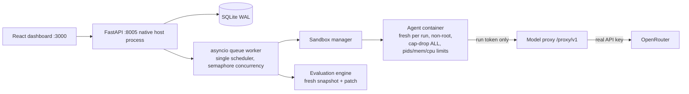
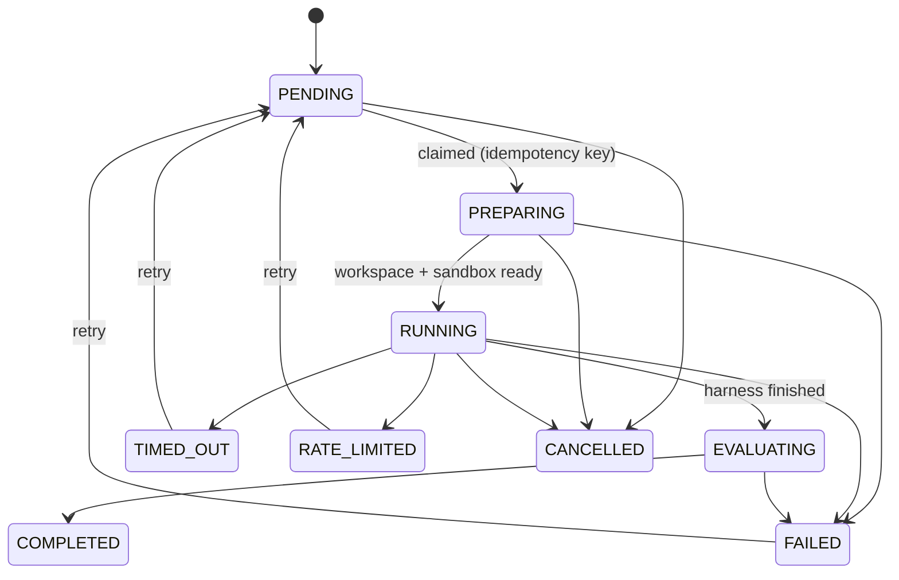

# Architecture

Local, single-user platform benchmarking harness × model combinations against tasks from your own repository. Spec: `../generationDoc.md`. Reviewed plan: `implementation-plan.md`.

## System overview

## Run lifecycle

Crash recovery: containers are labeled `aso.run_id`; on startup a reconciliation sweep removes orphans and moves stale PREPARING/RUNNING/EVALUATING rows to FAILED(crash), retryable.

## Leakage prevention (historical replay)

1. Workspace = `git archive` at the **base** commit extracted into a fresh directory, then `git init` + one synthetic commit. No original history, no remotes, no hooks. The solution commit never enters the sandbox.
2. Two-phase network: **PREP** (bridge, egress allowed — dependency install and baseline run before any agent code executes) → **sealed** (per-run `internal: true` network). An internal network has no default route at all, including to the host gateway, so the proxy is reached via a per-run **relay container** attached to both networks. `seal()` fail-closes in both directions: external egress must be dead *and* the proxy reachable.
3. Hidden tests are extracted from the target commit conservatively (tests importing target-only modules are rejected), require user approval, and run only after the agent stops.
4. The container receives a short-lived per-run token, never the OpenRouter key. The proxy pins the model, enforces request/token/spend budgets, and records every request.

## Evaluation integrity

Grading never happens in the agent's workspace. The only agent input is the patch, applied to a fresh snapshot and run with evaluator-owned commands. Patches touching test files, CI config, or Makefiles score zero (prohibited-file gate). Regressions are detected by per-test-case identity against the baseline (vanished tests count as regressions). When no deterministic signal exists the task is marked `INSUFFICIENT_EVALUATION_SIGNAL` and produces no winner.

MVP caveat: evaluator commands execute on the host against the fresh snapshot (same trust level as baseline validation). Moving evaluation execution into a fresh container is the next hardening step.

## Scoring

Weights: correctness 50 / reliability 20 / execution efficiency 15 / token efficiency 10 / resource efficiency 5. Efficiency is normalized within each task cohort (documented caveat: cohort-relative) and gated by correctness so a fast wrong answer earns nothing. Eligibility rules (never patches, >50% timeouts, insufficient signal, zero completed reps) exclude combinations from recommendations. Under 3 completed repetitions results are flagged statistically weak; no significance claims.

## Security limitations

Local Docker sandboxing is appropriate for trusted MVP testing. It is **not** hardened multi-tenant isolation: containers share the host kernel, evaluation commands run on the host, and the backend itself is unauthenticated localhost. Do not point this at untrusted repositories you wouldn't run on your machine.

## Extension points

- **Providers**: implement `ModelProvider` (app/providers/base.py) — Ollama/vLLM/Groq fit behind the same `complete()`/`list_models()` shape.
- **Harnesses**: implement `HarnessAdapter` (app/harnesses/base.py) and `register()` it; sandboxed harnesses get a container + proxy token (see mini_swe_agent.py). OpenHands and smolagents land here.
- **Evaluators**: extend `evaluate()` in app/evaluators/engine.py; differential testing and generated tests are documented TODOs, not implemented.
