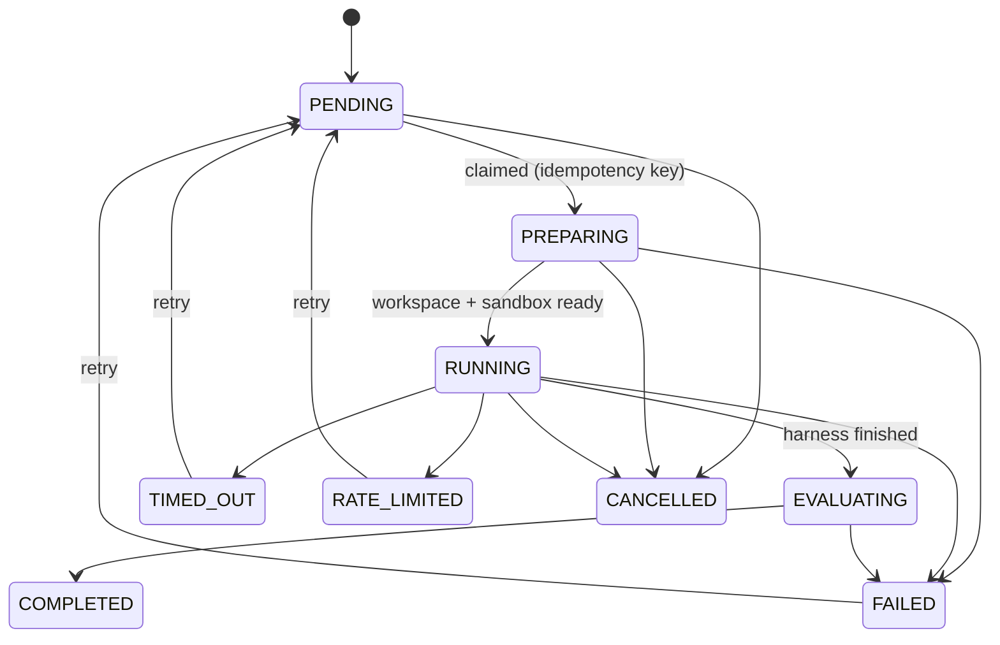

# Run Lifecycle

Source: `generationDoc.md` §13. Implemented in `app/orchestration/queue.py`. Index: [[00 Index]].

## States

Transitions are validated against `VALID_TRANSITIONS` (`app/models/core.py`); an illegal transition raises rather than silently corrupting state.

## What happens in each phase

| State | Work |
|---|---|
| `PENDING` | Waiting to be claimed. Paused experiments are skipped, not dequeued. |
| `PREPARING` | Build workspace ([[Leakage Prevention]] snapshot), create container on bridge, `seal()` to internal network, issue run token |
| `RUNNING` | Harness executes **inside** the container; its only network path is the proxy |
| `EVALUATING` | Patch extracted and graded on a **fresh** snapshot on the host ([[Evaluation Engine]]) |
| `COMPLETED` / `FAILED` / `TIMED_OUT` / `CANCELLED` | Terminal; token revoked, container and workspace cleaned up |

## Concurrency and safety

- **Single scheduler per process** — the worker refuses to start twice; `make dev` runs uvicorn without `--workers`
- **Concurrency** is a semaphore, default 1, configurable
- **Idempotency keys** (`{combination_id}:{repetition}`) prevent double execution
- **Pause** stops claiming new runs; it does not kill in-flight work
- **Cancel** kills the container and marks `CANCELLED`
- All Docker SDK calls run via `asyncio.to_thread` — the SDK is synchronous and must never block the event loop

## Crash recovery

Containers are labelled `aso.run_id`. On startup a reconciliation sweep (`app/orchestration/recovery.py`) removes orphaned containers and moves stale `PREPARING`/`RUNNING`/`EVALUATING` rows to `FAILED(crash)`, which is retryable.

## Known gap

`RATE_LIMITED` is defined and reachable in the state machine but **nothing ever transitions into it** — `queue.py::_run_guarded` catches every exception into `FAILED(HARNESS)`. See [[Known Defects]] #6. This matters enormously under [[Rate Limits]].

## Related

- [[System Overview]] · [[Sandbox]] · [[Model Proxy]] · [[Known Defects]]
