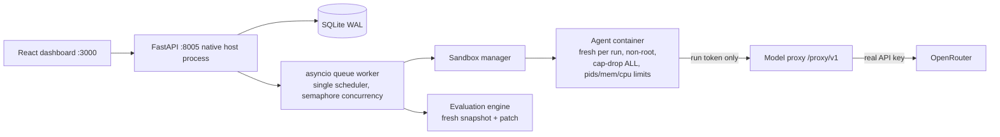

# System Overview

Index: [[00 Index]]. Original: `docs/architecture.md`.



> **Port note:** backend runs on **8005**, not 8000. `Makefile`, `app/core/config.py::backend_port`, `vite.config.ts` proxy, and `queue.py::DOCKER_PROXY_BASE` must all agree — they derive from the single `backend_port` setting.

## Layers, and the rule that keeps them apart

Per §31: provider, harness, sandbox, task, evaluator, and scoring layers stay independent.

- **Do not** put harness-specific logic in the orchestrator (`queue.py`)
- **Do not** put provider-specific logic in harness adapters

| Layer | Path | Responsibility |
|---|---|---|
| API | `backend/app/api/` | HTTP surface, no business logic |
| Orchestration | `backend/app/orchestration/` | Queue, state machine, crash recovery |
| Harnesses | `backend/app/harnesses/` | Adapters normalizing to `HarnessRunResult` |
| Providers | `backend/app/providers/` | Model access normalized to `ModelProvider` |
| Sandboxes | `backend/app/sandboxes/` | Docker lifecycle, network sealing |
| Repositories | `backend/app/repositories/` | Registration, detection, snapshots, baseline |
| Tasks | `backend/app/tasks/` | Historical replay, hidden-test extraction |
| Evaluators | `backend/app/evaluators/` | Grading a patch |
| Scoring | `backend/app/scoring/` | Aggregation, ranking, recommendations |

See [[Codebase Map]] for file-level detail.

## The end-to-end flow

```
register repo → analyze → edit commands → baseline
  → task from commit (+ hidden-test approval)
  → configure experiment → preflight
  → queue: PENDING → PREPARING → RUNNING → EVALUATING → COMPLETED
  → aggregate → recommend → view
```

Detail: [[Run Lifecycle]]. Safety: [[Leakage Prevention]].

## Why the backend is not containerized

It spawns *sibling* sandbox containers via the host Docker daemon. Containerizing the control plane would need a `docker.sock` mount (security-sensitive) plus container→host path translation for every workspace bind mount. See [[ADR-004 Backend on Host]].

## Related

- [[Run Lifecycle]] · [[Sandbox]] · [[Model Proxy]] · [[Evaluation Engine]] · [[Scoring and Ranking]]
